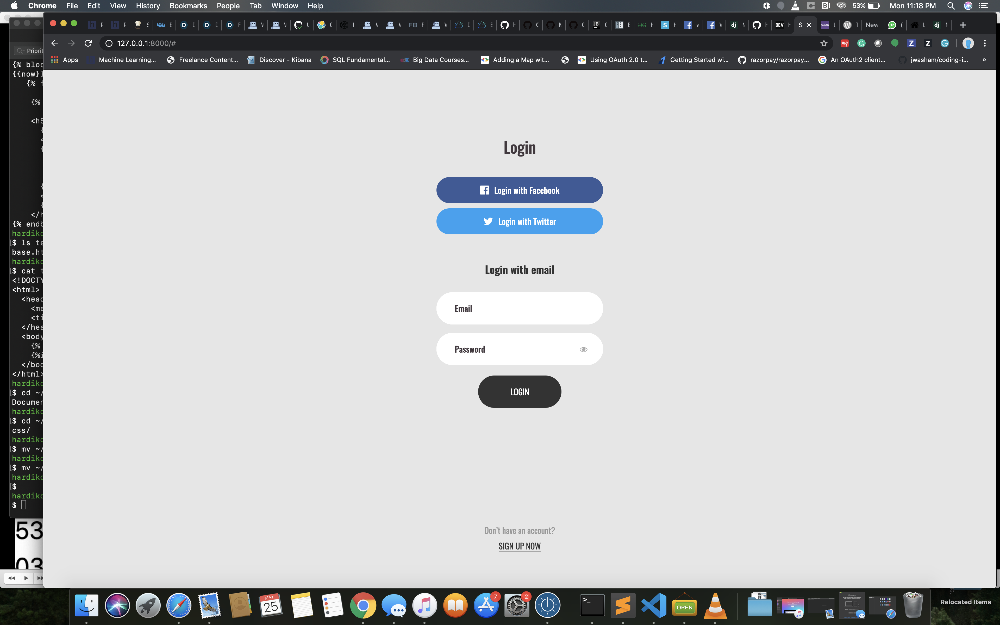
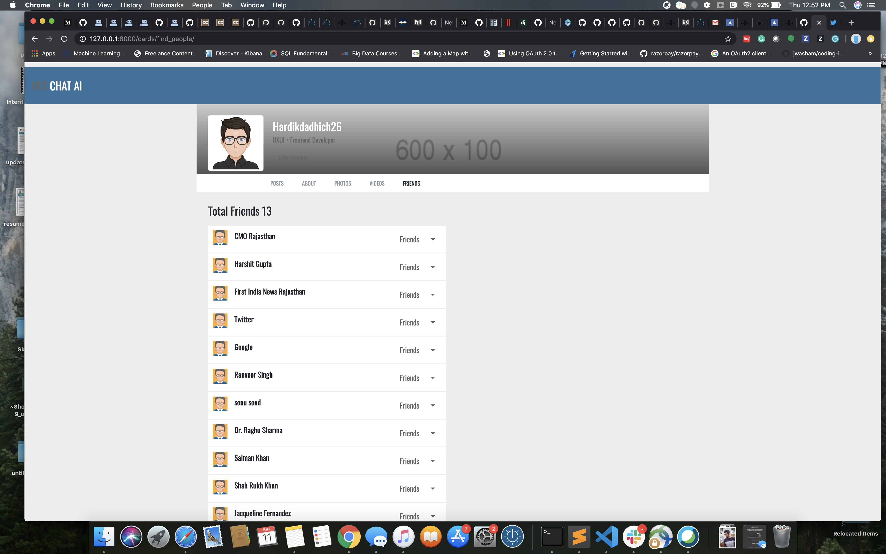

## WIT_AI

Requires :

- pipenv: latest

# How to setup this project on ubuntu:

- Clone this repo.
- In the project directory run `pipenv shell` to activate the environment.
- then run `pipenv install` .
- then finally run the command `python manage.py runserver`.

* In case if you stuck:  
refer https://github.com/pypa/pipenv/issues/2608
 

# First View

- Login with your Facebook or twitter Account

# Second view (Cards/different options to talk with WIT)

# third view (Find your twiter friends stay connected)

# fourth view (talk with wit through speech and get recommended friends)

